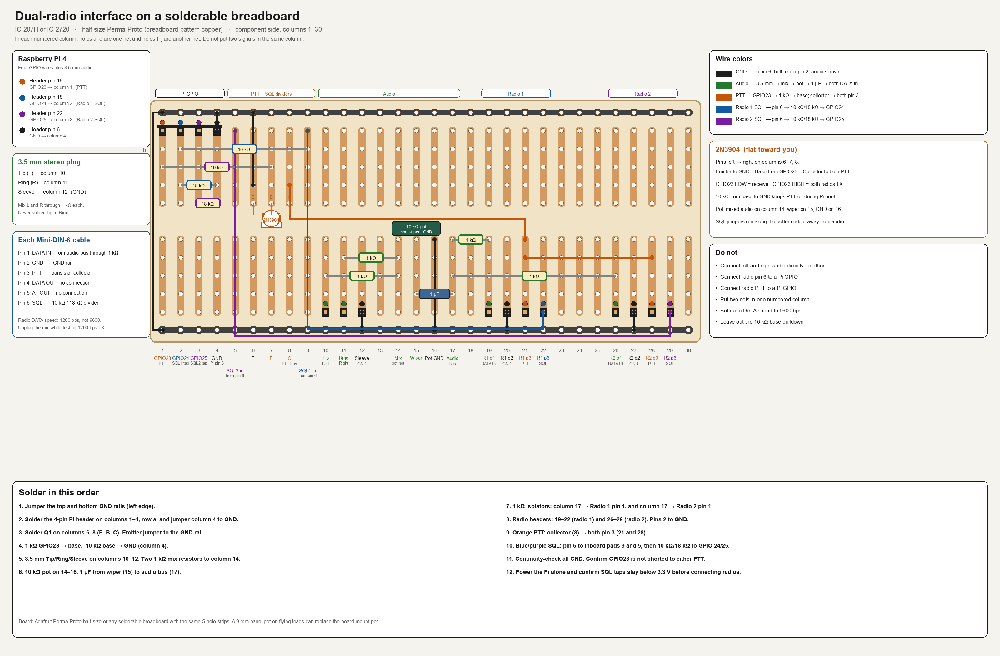

# Raspberry Pi 4 → Two Radios (IC-207H or IC-2720) Interface

## Overview

This design connects a Raspberry Pi 4 to **two Icom radios** through their 6-pin Mini-DIN DATA connectors.

The production radios are **IC-207H**. An **IC-2720** may be used for initial development and testing. The DATA jack pinout, PTT (ground to key), and pin 6 SQL behavior are the same on both.

The design provides:

- **Shared audio/DATA IN** from the Raspberry Pi's built-in 3.5-mm analog audio output
- **Shared PTT** for both radios
- **Independent P SQL inputs** so the Raspberry Pi can determine which radio has its squelch open
- Common ground between the Raspberry Pi and both radios
- Electrical isolation of the Pi GPIOs from the radio PTT and P SQL circuits

The proposed Raspberry Pi GPIO assignments are:

| Function | Raspberry Pi GPIO | Physical pin |
|---|---:|---:|
| Shared PTT | GPIO23 | 16 |
| Radio 1 P SQL | GPIO24 | 18 |
| Radio 2 P SQL | GPIO25 | 22 |
| Ground | — | 6 |
| Audio | Built-in 3.5-mm jack | — |

Only the following DATA connector pins are used:

| DATA pin | Function | Connection |
|---:|---|---|
| 1 | DATA IN | Shared Pi audio |
| 2 | GND | Pi ground |
| 3 | PTT | Shared transistor-switched PTT |
| 4 | DATA OUT | Not connected |
| 5 | AF OUT | Not connected |
| 6 | P SQL | Independent GPIO input |

---

# 1. System architecture

```text
                         RASPBERRY PI 4
                  ┌────────────────────────┐
                  │                        │
                  │  3.5 mm AUDIO OUT      │
                  │          │             │
                  │          ▼             │
                  │    L/R mixing          │
                  │          │             │
                  │    10k level control   │
                  │          │             │
                  │         1uF            │
                  │          │             │
                  │       AUDIO BUS        │
                  │        /     \         │
                  │       /       \        │
                  │      1k       1k       │
                  │      │         │       │
                  │      ▼         ▼       │
                  │   Radio 1   Radio 2    │
                  │   DATA IN   DATA IN     │
                  │                        │
                  │                        │
                  │ GPIO23 ─── shared PTT │
                  │                        │
                  │ GPIO24 ◄── Radio 1 SQL│
                  │ GPIO25 ◄── Radio 2 SQL│
                  │                        │
                  │ GND ───── common GND  │
                  └────────────────────────┘
```

Both radios receive the same audio and are keyed simultaneously.

The two P SQL signals remain completely independent.

---

# 2. Audio / DATA IN circuit

The Raspberry Pi's built-in 3.5-mm jack provides stereo audio. Do not connect the left and right outputs directly together.

Use a resistor from each channel to create a passive stereo-to-mono mixer.

```text
Pi 3.5-mm jack

Tip (Left)  ───── 1kΩ ─────┐
                            │
Ring (Right) ─── 1kΩ ──────┤
                            │
                            ▼
                     10kΩ LEVEL POT
                            │
                            ▼
                           1uF
                            │
                       AUDIO BUS
                            │
                    ┌───────┴───────┐
                    │               │
                   1kΩ             1kΩ
                    │               │
                    ▼               ▼
             Radio 1 pin 1   Radio 2 pin 1
               DATA IN         DATA IN

Pi audio sleeve ───────────────────────── Common GND
```

## Recommended components

- 2 × 1 kΩ resistors for L/R mixing
- 1 × 10 kΩ potentiometer for audio level
- 1 × 1 µF coupling capacitor
- 2 × 1 kΩ resistors, one for each radio DATA IN
- Appropriate 3.5-mm stereo plug
- Shielded audio cable is preferable

### Potentiometer wiring

Use the 10 kΩ potentiometer as a voltage divider:

- One outer terminal → mixed audio
- Other outer terminal → GND
- Wiper → 1 µF capacitor
- Capacitor output → DATA IN distribution

This provides a physical transmit-audio level adjustment.

The capacitor provides DC isolation between the Raspberry Pi audio output and the radio DATA inputs.

### DATA IN distribution

After the coupling capacitor, split the signal through separate 1 kΩ resistors:

```text
                         1kΩ
AUDIO BUS ─────────────/\/\/\/──── Radio 1 pin 1

                         1kΩ
         └─────────────/\/\/\/──── Radio 2 pin 1
```

The resistors prevent the two DATA IN inputs from significantly interacting.

---

# 3. Shared PTT circuit

The radio PTT input should be treated as a switch-to-ground input.

Do not connect a Raspberry Pi GPIO directly to either radio's PTT pin.

Use an NPN transistor as an open-collector switch.

```text
                         Radio 1 pin 3
                              PTT
                               │
                               │
                               ├─────────────┐
                               │             │
                               │          Collector
                               │             │
GPIO23 ───── 1kΩ ──────────────┤ Base      Q1
                                             2N3904
                                            Emitter
                                               │
                                               │
                                              GND
                                               │
                         Radio 2 pin 3 ────────┘
                              PTT
```

The actual electrical arrangement is:

```text
                         Q1 2N3904
GPIO23 ── 1kΩ ──────── Base
                         Collector ───┬── Radio 1 pin 3
                                      │
                                      └── Radio 2 pin 3
                         Emitter ─────── GND
```

Add a 10 kΩ resistor from the transistor base to ground:

```text
GPIO23 ── 1kΩ ── Base
                 │
                10kΩ
                 │
                GND
```

The 10 kΩ resistor ensures the transistor remains off while GPIO23 is floating during Raspberry Pi startup.

## PTT operation

```text
GPIO23 LOW       → transistor OFF → both radios receive
GPIO23 HIGH      → transistor ON  → both radios transmit
```

The transistor should be rated for at least several tens of milliamps; a 2N3904, 2N2222, or similar small-signal NPN transistor is suitable.

---

# 4. Radio 1 P SQL input

The radio SQL output (pin 6; labeled SQ on the IC-207H, P SQL on the IC-2720) can reach approximately +5 V.

Raspberry Pi GPIO inputs are **not 5-V tolerant**, so do not connect P SQL directly to GPIO24.

Use a voltage divider:

```text
Radio 1 pin 6
        P SQL
          │
         10kΩ
          │
          ├────────────── GPIO24
          │
         18kΩ
          │
         GND
```

At 5 V:

```text
GPIO24 = 5V × 18kΩ / (10kΩ + 18kΩ)

       ≈ 3.21 V
```

This is an appropriate HIGH level for a Raspberry Pi GPIO.

When P SQL is low:

```text
GPIO24 ≈ 0 V
```

---

# 5. Radio 2 P SQL input

Use an entirely separate divider for the second radio:

```text
Radio 2 pin 6
        P SQL
          │
         10kΩ
          │
          ├────────────── GPIO25
          │
         18kΩ
          │
         GND
```

At 5 V:

```text
GPIO25 ≈ 3.21 V
```

Do **not** connect the two P SQL outputs together.

The software can therefore independently determine the status of each radio:

```text
GPIO24 HIGH → Radio 1 P SQL active
GPIO25 HIGH → Radio 2 P SQL active
```

---

# 6. Grounding

All three devices/circuits share a common ground:

```text
Pi GND
  │
  ├──────── Radio 1 pin 2
  │
  └──────── Radio 2 pin 2
```

Preferably make the common ground connection near the interface/cable assembly.

The radio DATA connector pin 2 is the DATA interface ground.

---

# 7. Complete wiring table

## Raspberry Pi

| Pi connection | Physical pin | Connects to |
|---|---:|---|
| GPIO23 | 16 | 1 kΩ → PTT transistor base |
| GPIO24 | 18 | Radio 1 P SQL divider midpoint |
| GPIO25 | 22 | Radio 2 P SQL divider midpoint |
| GND | 6 | Both radio pin 2 connections and circuit grounds |

## Radio 1

| DATA pin | Function | Connection |
|---:|---|---|
| 1 | DATA IN | Audio bus through 1 kΩ |
| 2 | GND | Pi GND |
| 3 | PTT | PTT transistor collector |
| 4 | DATA OUT | NC |
| 5 | AF OUT | NC |
| 6 | P SQL | 10 kΩ / 18 kΩ divider → GPIO24 |

## Radio 2

| DATA pin | Function | Connection |
|---:|---|---|
| 1 | DATA IN | Audio bus through 1 kΩ |
| 2 | GND | Pi GND |
| 3 | PTT | PTT transistor collector |
| 4 | DATA OUT | NC |
| 5 | AF OUT | NC |
| 6 | P SQL | 10 kΩ / 18 kΩ divider → GPIO25 |

---

# 8. Complete circuit diagram

```text
                          RASPBERRY PI 4

       3.5-mm AUDIO JACK
       ┌─────────────────────┐
       │ Tip / LEFT ──1kΩ────┐
       │                     │
       │ Ring / RIGHT ─1kΩ───┤
       │                     │
       │ Sleeve ─────────────┼──────────── GND
       └─────────────────────┘            │
                                          │
                                  ┌───────┴───────┐
                                  │               │
                               10kΩ LEVEL POT     │
                                  │               │
                                  └─── 1µF ───────┘
                                          │
                                     AUDIO BUS
                                      /       \
                                     /         \
                                   1kΩ         1kΩ
                                    │            │
                                    │            │
                             Radio 1 pin 1   Radio 2 pin 1
                               DATA IN         DATA IN


       GPIO23 ───── 1kΩ ──────┐
                              │
                             BASE
                              │
                           ┌──┴──┐
                           │ Q1  │
                           │2N3904
                           └──┬──┘
                              │
                         COLLECTOR
                              │
                         ┌────┴────┐
                         │         │
                         ▼         ▼
                    Radio 1     Radio 2
                    pin 3 PTT   pin 3 PTT

                         EMITTER
                              │
                             GND

       GPIO23 ───── 10kΩ ───── GND


       Radio 1 pin 6 P SQL
                 │
                10kΩ
                 │
                 ├──────── GPIO24
                 │
                18kΩ
                 │
                GND


       Radio 2 pin 6 P SQL
                 │
                10kΩ
                 │
                 ├──────── GPIO25
                 │
                18kΩ
                 │
                GND


       Pi GND ───────── Radio 1 pin 2 GND
          │
          └──────────── Radio 2 pin 2 GND
```

---

# 9. GPIO software behavior

A sensible initial GPIO configuration is:

```python
GPIO23 = OUTPUT
GPIO24 = INPUT
GPIO25 = INPUT
```

Set GPIO23 LOW immediately during program initialization so the radios cannot inadvertently be keyed.

Conceptually:

```python
# Receive
GPIO23 = LOW

radio1_sql = GPIO24
radio2_sql = GPIO25

# Transmit
GPIO23 = HIGH

# Return to receive
GPIO23 = LOW
```

For production software, configure GPIO23 as LOW as early as possible during startup and use appropriate cleanup handling so that an exception does not leave the radios transmitting.

---

# 10. Recommended physical construction

Hole-by-hole layout on a half-size solderable breadboard (Perma-Proto pattern):



Gerber files for a 100 × 60 mm 2-layer PCB (PCBWay upload zip): [`pcbway/DualRadioIF.zip`](pcbway/DualRadioIF.zip). Order notes and BOM: [`pcbway/README.md`](pcbway/README.md).

A small interface box between the Raspberry Pi and the two radios is preferable.

The box can contain:

- 2 × 6-pin Mini-DIN plugs for the radios
- 1 × 3.5-mm stereo audio input from the Pi
- 1 × 10 kΩ audio level potentiometer
- 1 × 2N3904 transistor
- 1 × 1 kΩ PTT base resistor
- 1 × 10 kΩ PTT base pull-down
- 2 × 10 kΩ P SQL upper-divider resistors
- 2 × 18 kΩ P SQL lower-divider resistors
- 2 × 1 kΩ DATA IN isolation resistors
- 2 × 1 kΩ audio mixing resistors
- 1 × 1 µF audio coupling capacitor

Use shielded cable for the audio connection where practical.

Keep the P SQL wiring away from the audio wiring to reduce the possibility of RF/audio coupling.

---

# 11. Important operating considerations

### Both radios transmit simultaneously

With this circuit, GPIO23 keys both radios at the same time.

The same Pi audio signal is also sent to both radios.

If the desired operation is to transmit the same announcement on both radios simultaneously, this is appropriate.

### Independent receive detection

The two P SQL inputs are independent:

```text
GPIO24 → Radio 1
GPIO25 → Radio 2
```

This allows the software to determine which radio is receiving.

### PTT is shared

There is no independent radio-selective PTT in this version.

If individual transmit control is needed later, the PTT circuit can be expanded to provide:

```text
Master PTT
Radio 1 PTT enable
Radio 2 PTT enable
```

without changing the audio or P SQL circuits.

### Do not connect 5 V to Pi GPIOs

In particular:

- Radio P SQL must go through the voltage divider.
- Never connect radio pin 6 directly to GPIO24 or GPIO25.
- Never connect radio PTT directly to a Pi GPIO.

---

# 12. Suggested first test procedure

Before connecting the radios:

1. Build the interface.
2. Verify continuity between all intended grounds.
3. Verify that GPIO23 cannot directly connect to either radio PTT.
4. Power the Pi and measure the P SQL GPIO inputs.
5. Confirm GPIO24 and GPIO25 remain below 3.3 V under all conditions.
6. Test GPIO23 with the radios disconnected and verify the transistor switches correctly.
7. Connect one radio first.
8. Verify PTT operation with the radio at low power.
9. Verify P SQL operation.
10. Connect the second radio.
11. Verify that both radios key together.
12. Adjust the audio level potentiometer for the desired DATA IN level.

For the first live test, use the radios' lowest practical transmit power and monitor the transmitted audio carefully.

---

# 13. Parts summary

| Qty | Component | Suggested value/type |
|---:|---|---|
| 2 | Audio mixing resistors | 1 kΩ |
| 1 | Audio level potentiometer | 10 kΩ |
| 1 | Coupling capacitor | 1 µF |
| 2 | DATA IN isolation resistors | 1 kΩ |
| 1 | PTT transistor | 2N3904 or 2N2222 |
| 1 | PTT base resistor | 1 kΩ |
| 1 | PTT base pull-down | 10 kΩ |
| 2 | P SQL upper resistors | 10 kΩ |
| 2 | P SQL lower resistors | 18 kΩ |
| 2 | 6-pin Mini-DIN plugs | Radio DATA connector (IC-207H or IC-2720) |
| 1 | 3.5-mm stereo plug | Pi audio |
| 1 | Small enclosure | Interface box |

---

## Final connection summary

```text
                    PI GPIO23
                       │
                       ▼
                  ┌─────────┐
                  │  2N3904 │
                  └────┬────┘
                       │
              ┌────────┴────────┐
              ▼                 ▼
          RADIO 1           RADIO 2
          PTT pin 3         PTT pin 3


PI AUDIO ── level control ──┬── 1k ── Radio 1 DATA IN
                             │
                             └── 1k ── Radio 2 DATA IN


Radio 1 P SQL ── divider ── GPIO24
Radio 2 P SQL ── divider ── GPIO25


PI GND ─────── Radio 1 GND
    │
    └───────── Radio 2 GND
```

This is the recommended basic hardware architecture for a two-radio IC-207H or IC-2720 interface using the Raspberry Pi 4's built-in analog audio output.
