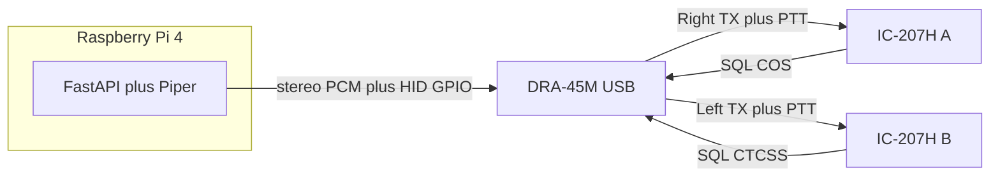

# Hardware: Pi 4 + one DRA-45M for two IC-207Hs

The app is a long-running **FastAPI + Piper + PortAudio** service. GPIO is still [`StubRadio`](../app/radio.py).

**Host: Raspberry Pi 4** (64-bit Raspberry Pi OS).

**Radio interface: one Masters [DRA-45M](https://www.masterscommunications.com/products/radio-adapter/dra/dra-index.html)** (assembled, metal case) plus a **custom DB9 → two Mini-DIN-6** cable. One USB plug to the Pi. Both repeaters hear the same announcement, key together, and report busy independently.

A **single DRA-36M cannot do this.** Its Mini-DIN-6 has only one TX pin and one COS pin. Masters’ **DRA-Switch** is A/B (one radio at a time), not simultaneous. Mixers (DRA-3M) go the other way (several sound cards into one radio).

## Why the DRA-45M (not 36M)

The CM119A is a **stereo** USB codec with **two logic inputs** (AllStar COS and CTCSS — the old volume-up / volume-down HID bits) and **one hardware PTT** (GPIO3).

[DRA-45 / 45M DB9](https://www.masterscommunications.com/products/radio-adapter/dra/txt/dra45-DB9-pinout.txt):

- Pin 1 — Main TX audio (**right** channel; typical “radio” path)
- Pin 8 — Aux TX audio (**left** channel) when **JU5** is installed
- Pin 3 — PTT (one line; wire to **both** radios’ pin 3)
- Pin 2 — COS when **JU3** installed → radio A SQL (pin 6)
- Pin 4 — CTCSS when **JU4** installed → radio B SQL (pin 6)
- Pin 6 — ground

JU5 is documented as **left-channel TX to pin 8**. Install JU3, JU4, and JU5 (digital-mode docs say to *remove* them; this app needs them **on**).

45M vs 45: metal case, same signals; 45M is the easier assembled unit. Icom packet PTT is ground-to-key; one transistor or relay can key **both** 207Hs in parallel. Prefer the M-series if it offers the relay jumper (same idea as the 36M) so odd Icom PTT loads are covered.

## Custom cable (required)

No stock Masters DIN6 cable fans a DB9 out to two 207Hs. Have **URI Cables / Plun-N-Play** (Masters points people there) build a DB9 male to **two Mini-DIN-6 males**, or solder it:

- Shared: ground, PTT (DRA pin 3 → both radios pin 3)
- Radio A: Data In ← DRA pin 1 (right), SQL → DRA pin 2 (COS)
- Radio B: Data In ← DRA pin 8 (left), SQL → DRA pin 4 (CTCSS)
- Unused on each DIN6: pins 4/5 (RX) unless you later want discriminator audio

Keep 1200 bps / limiter path on **both** radios ([connectors.md](connectors.md)).

## Fallback: two DRA-36Ms

If you want **stock Mini-DIN-6 cables** and no custom wiring: two assembled **DRA-36M**s, two USB ports. Software then keys **two** HID PTT bits and plays the same PCM on **two** PortAudio devices (or a combined sink). Independent COS is native. Cost and failure modes are doubled; keep this as backup, not the first buy.

## Cost (list prices, shipping extra)

Masters list (assembled and tested, metal case): **DRA-45M $110**, **DRA-36M $101**. Stock cables: **DIN6-Shortie $10**, **DRAC-12 $12**. Masters does not make custom cables.

- **One DRA-45M + DIY Y-cable:** $110 + about $20–40 in connectors/wire → **about $130–150**
- **One DRA-45M + custom Y-cable:** $110 + a quote. Plug N Play’s stock single-radio Icom cables are **$68**; a dual-radio Y is a special and may be similar or a bit more → **about $180** if that holds. Ask [Plug N Play](https://www.plugnplaycables.com/).
- **Two DRA-36M + two DIN6-Shorties:** $202 + $20 → **$222**
- **Two DRA-36M + two DRAC-12:** $202 + $24 → **$226**

The 45M path is cheaper even with a ~$70 custom cable. Two 36Ms buy stock cables and simpler software-per-radio isolation at about **$70–90 more**.

## Busy and PTT behavior

- **`channel_busy()` is true if either repeater is busy.** Defer (existing retry / give-up timers) until **both** are clear, then key **both** and play. Never announce into a QSO on one machine while the other is idle.
- **`set_ptt(True)`** asserts CM119 GPIO3 once; both radios key. Existing `TTS_PTT_LEAD_SECONDS` still applies before audio.
- SQL polarity: COS/CTCSS hardware is **active-low**. Each 207H SQL **goes high when squelch is open**. Invert per radio in software if the pin also sinks when squelched; otherwise use Masters’ NPN inverter on that radio. Confirm with a DMM.

## Software later

[`play_chunks`](../app/playback.py) today opens `channels=chunk.channels` (mono). Upmix Piper PCM to **2 channels with identical samples** so L and R are the same announcement.

[`StubRadio`](../app/radio.py) → one HID device:

- `set_ptt` → GPIO3
- `channel_busy()` → COS **or** CTCSS asserted (after invert)
- udev so the service user can open `hidraw`

No Pi GPIO header. NUC is still optional (same USB box, better SSD, more idle power). Zeros / ESP8266 still not hosts. DRA-Pi-Zero HAT is irrelevant.

## Storage and power

Quality A2 microSD or USB SSD. Official-class 5 V / 3 A USB-C supply.
